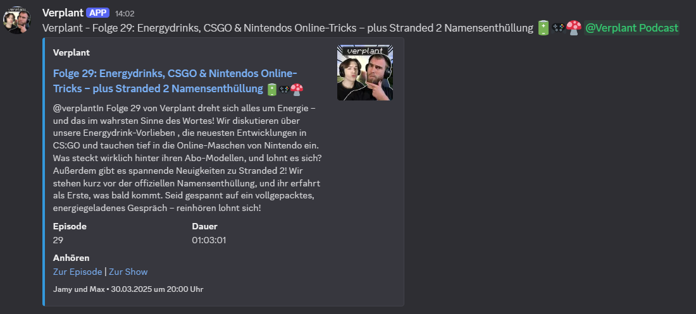

# Podcast RSS to Discord Webhook

A Python script that monitors podcast RSS feeds and automatically announces new episodes via Discord webhooks. Optionally, the Spotify API can be used to provide direct links to Spotify episodes and shows.


<td></td>

## Features

- Monitors multiple podcast RSS feeds
- Sends notifications via Discord webhooks
- Extracts podcast information (title, description, date, duration, etc.)
- Supports role mentions in Discord
- Optional Spotify API integration for direct links to episodes and shows
- Customizable bot names and avatars for Discord messages
- Stores already sent episodes in a SQLite database

## Requirements

- Python 3.9 or higher
- Pip (Python package manager)
- Access to Discord webhooks
- Optional: Spotify Developer account for API access

## Installation

1. Clone the repository or download the files:
   ```bash
   git clone https://git.fastm.de/Max/Podcast-Discord-Notification.git
   cd podcast-rss-discord
   ```

2. Create a virtual Python environment and install the required packages:
   ```bash
   python -m venv venv
   source venv/bin/activate  # On Windows: venv\Scripts\activate
   pip install feedparser requests python-dotenv zoneinfo
   ```

3. Customize the ```.env``` file according to your needs (see Configuration below)

4. Adjust the execution script ```run_spotify_rss.sh``` if the path differs:
   ```bash
   #!/bin/bash
   cd /path/to/your/project
   source venv/bin/activate
   python spotify_rss.py
   ```

5. Make the execution script executable:
   ```bash
   chmod +x run_spotify_rss.sh
   ```

## Configuration

The ```.env``` file contains all necessary configuration options. A sample file is already included in the repository:

```
# Spotify API credentials (optional) Used to correctly link the current episode!
# SPOTIFY_CLIENT_ID=your_spotify_client_id
# SPOTIFY_CLIENT_SECRET=your_spotify_client_secret

# Feed 1 Configuration
FEED_URL_1=https://anchor.fm/s/abc123/podcast/rss # Link to Spotify RSS feed
WEBHOOK_URL_1=https://discord.com/api/webhooks/123456789/abcdefghijklmnopqrstuvwxyz # Discord channel webhook URL
SPOTIFY_SHOW_ID_1=123456789 # Optional Required when using the API to find the podcast!
ROLE_ID_1=123456789123456 # Optional Discord role ID to be mentioned!
#BOT_NAME_1=Podcast Bot # Optional and can be omitted, then RSS feed info is used
#BOT_AVATAR_1=https://example.com/podcast_logo.png # Optional and can be omitted, then RSS feed info is used

# Feed 2 Configuration
# FEED_URL_2=https://anchor.fm/s/abc123/podcast/rss # Link to Spotify RSS feed
# WEBHOOK_URL_2=https://discord.com/api/webhooks/123456789/abcdefghijklmnopqrstuvwxyz # Discord channel webhook URL
# SPOTIFY_SHOW_ID_2=123456789 # Optional Required when using the API to find the podcast!
# ROLE_ID_2=123456789123456  # Optional Discord role ID to be mentioned!
# BOT_NAME_2=Podcast Bot # Optional and can be omitted, then RSS feed info is used
# BOT_AVATAR_2=https://example.com/podcast_logo.png # Optional and can be omitted, then RSS feed info is used

# Feed 3 Configuration
# .
# .
# .

# Feed 4 Configuration
#. 
#. 
#.
```

### Configuration Options

1. **Spotify API Credentials** (optional):
   - ```SPOTIFY_CLIENT_ID```: Your Spotify Developer Client ID
   - ```SPOTIFY_CLIENT_SECRET```: Your Spotify Developer Client Secret
   - These are needed to use the Spotify API and correctly link episodes.

2. **Feed Configuration** (one group for each feed):
   - ```FEED_URL_X```: The URL of the podcast's RSS feed
   - ```WEBHOOK_URL_X```: The Discord webhook URL to which notifications will be sent
   - ```SPOTIFY_SHOW_ID_X```: The Spotify Show ID of the podcast (optional, required for API usage)
   - ```ROLE_ID_X```: The Discord role ID to be mentioned in the notification (optional)
   - ```BOT_NAME_X```: The name to be displayed for the webhook bot (optional)
   - ```BOT_AVATAR_X```: The URL of the avatar for the webhook bot (optional)

You can configure as many feeds as you want by continuing the numbering (FEED_URL_3, WEBHOOK_URL_3, etc.).

### Setting up the Spotify API (optional)

1. Visit [Spotify Developer Dashboard](https://developer.spotify.com/dashboard/)
2. Sign in or create an account
3. Create a new app
4. Copy the Client ID and Client Secret into your ```.env``` file

### Setting up a Discord Webhook

1. Open Discord and go to the server and channel where you want to receive notifications
2. Go to Channel Settings → Integrations → Webhooks → New Webhook
3. Give the webhook a name and optionally select an image
4. Copy the webhook URL and paste it into your ```.env``` file

### Finding a Discord Role ID

1. Enable Developer Mode in Discord (Settings → Advanced → Developer Mode)
2. Right-click on the role → Copy Role ID
3. Paste the ID into your ```.env``` file

### Finding a Spotify Show ID

1. Open the podcast in Spotify
2. Copy the URL (e.g., ```https://open.spotify.com/show/1a2b3c4d5e6f7g8h9i0j```)
3. The ID is the part after ```/show/``` (in this example ```1a2b3c4d5e6f7g8h9i0j```)

## Usage

### Manual Execution

Run the script manually:

```bash
./run_spotify_rss.sh
```

### Automation with Cron (Linux/macOS)

To run the script regularly, you can set up a cron job:

1. Open the crontab file:
   ```bash
   crontab -e
   ```

2. Add a line to run the script every 15 minutes, for example:
   ```
   */15 * * * * /path/to/your/project/run_spotify_rss.sh >> /path/to/your/project/cron.log 2>&1
   ```

### Automation with Task Scheduler (Windows)

1. Open Task Scheduler
2. Create a new task
3. Set the task to run regularly (e.g., every 15 minutes)
4. As an action, select "Start a program" and enter the path to your batch script (create a .bat file with similar content to the .sh script)

## Customizing the Discord Message

The Discord message includes:

- Episode title
- Description (truncated to 1000 characters)
- Episode number (if present in the title)
- Episode duration
- Publication date
- Links to the episode and show (when Spotify API is enabled)
- Thumbnail image (from Spotify or the RSS feed)
- Name of the podcast creators (extracted from the RSS feed)

## Directory Structure

```
/home/scripts/spotify_rss/
├── spotify_rss.py       # Main script
├── .env                 # Configuration file
├── run_spotify_rss.sh   # Execution script
├── venv/                # Virtual Python environment
└── verplant_rss.db      # SQLite database for sent episodes
└── verplant_rss.log     # Log file
```

## Troubleshooting

The script creates a log file at ```/home/scripts/spotify_rss/verplant_rss.log```. Check this file if problems occur.

Common issues:

1. **No new episodes found**: Check if the RSS feed is correct and contains new episodes.
2. **Spotify API errors**: Check your Client ID and Client Secret.
3. **Discord webhook errors**: Make sure the webhook URL is valid.
4. **Path problems**: Check if the paths in ```run_spotify_rss.sh``` are correct.
5. **Permission problems**: Make sure the execution script is executable (```chmod +x run_spotify_rss.sh```).

## License

This project is licensed under the MIT License - see the LICENSE file for details.

## Contributing

Contributions are welcome! Simply create a pull request or open an issue if you have suggestions for improvements.

## Acknowledgments

This project uses the following open-source libraries:
- [feedparser](https://pypi.org/project/feedparser/)
- [requests](https://pypi.org/project/requests/)
- [python-dotenv](https://pypi.org/project/python-dotenv/)
- [zoneinfo](https://docs.python.org/3/library/zoneinfo.html)

